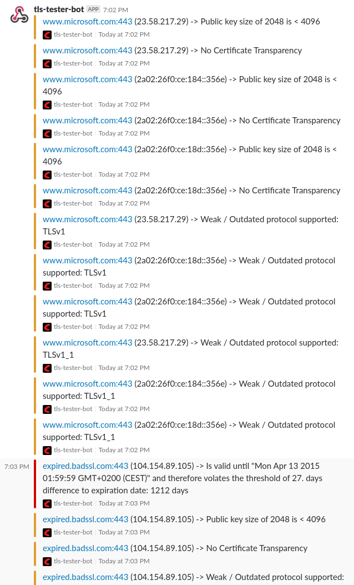
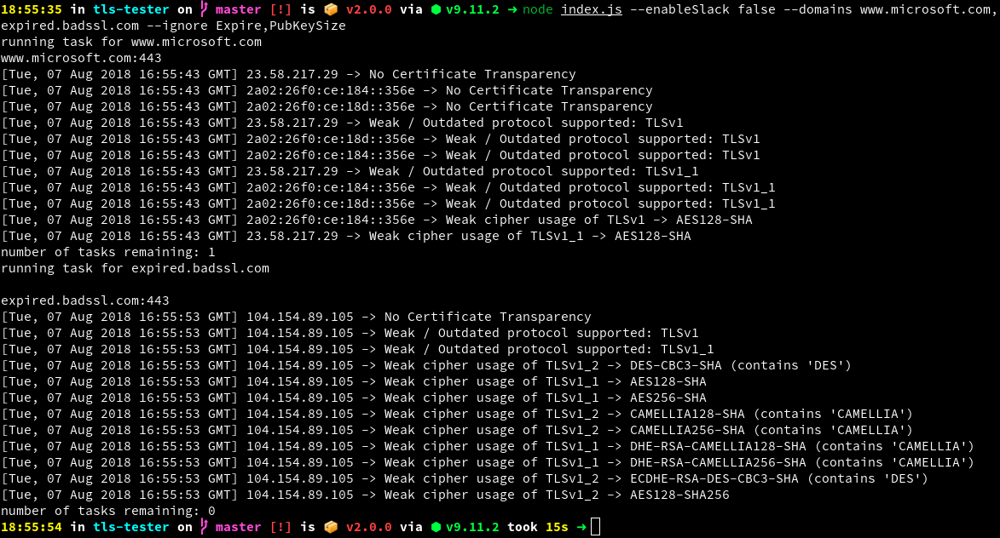

# How it looks
## Slack


## CLI
All config settings (or defaults via `Config.example.js`) are overwritten by cli parameters!

```bash
node index.js --enableSlack false --domains www.microsoft.com,expired.badssl.com --ignore Expire,PubKeySize
```



# Usage
* install nvm (https://github.com/creationix/nvm)
* install c/c++ build tools `apt install build-essentials make`
* `cp Config.example.js Config.js`
* edit Config.js
* run `npm start`

## Use as a Service
* Edit Config.js: set `startHttpServer` to `true` or overwride the option using the [CLI](#cli)
* `npm start`
* `curl -v -H 'content-type: application/json; charset=utf8' --data '{ "host": "mozilla-old.badssl.com", "callback":"https://callbackUrl" }' http://localhost:16636/api/enqueue`

### Add a task to the queue
A request path MUST be `/api/enqueue`<br/>
A request method MUST be `POST`<br/>
A request MUST have at least this properties:
```json
{
  "host": "fqdn"
}
```
**And** at least one of `"callback": "https://callbackUrl"` OR `"webhook": "https://webhookUrl"`.

`callback` and `webhook` must be HTTPS, if not disabled via config. (see option: `httpsCallbacksOnly` at `Config.example.js`)

Here is a example request object defining all supported properties:
```json
{
  "id": "some id", // this property gets autogenerated if you don't define this
  "host": "mozilla-old.badssl.com",
  "port": 443,
  "callback": "https://example.local/tls-test-result",
  "webhook": "https://hooks.slack.com/services/xxxxxx/xxxxxx/xxxxxx",
  "ignore": ["AES128-GCM-SHA256", "AES256-GCM-SHA384", "AES256-SHA256", "AES128-SHA256", "AES256-SHA", "AES128-SHA"],
  "callbackRawResultEnabled": true
}
```

Following is a example response body:
```json
[{
  "message": "OK",
  "task": {
    "id": "some id", // this property could look like "e0420ccf-b27e-4a26-8725-9b109803e7e7" if it was undefined by the request
    "host": "mozilla-old.badssl.com",
    "port": 443,
    "callback": "https://example.local/tls-test-result",
    "webhook": "https://hooks.slack.com/services/xxxxxx/xxxxxx/xxxxxx",
    "ignore": ["AES128-GCM-SHA256", "AES256-GCM-SHA384", "AES256-SHA256", "AES128-SHA256", "AES256-SHA", "AES128-SHA"],
    "callbackRawResultEnabled": true
  }
}]
```

#### Add multiple tasks at once to the queue
The request object might define `host` as `string[]`. This will generate seperate tasks based on the same properties.

Defining the property `id` in this case is not supported and an unique id will be generated for each task / host.

A example response body could look like this:
```json
[{
  "message": "OK",
  "task": [{
    "id": "5842f5e0-43d7-4cd2-be57-80d74b540793",
    "host": "expired.badssl.com",
    "port": 443,
    "callback": "https://your-server.local/tls-tester-result",
    "webhook": "",
    "ignore": [],
    "callbackRawResultEnabled": false
  }, {
    "id": "0d20ac5e-0c89-4576-935b-31ff11902b15",
    "host": "microsoft.com",
    "port": 443,
    "callback": "https://your-server.local/tls-tester-result",
    "webhook": "",
    "ignore": [],
    "callbackRawResultEnabled": false
  }]
}]
```

### Task completion handling
`callback` and `webhook` will be invoked on task completion.

`webhook` is compatible with services like: [Slack Incoming Webhooks](https://api.slack.com/incoming-webhooks) and [Mattermost Incoming Webhooks](https://docs.mattermost.com/developer/webhooks-incoming.html)

`callback` is a simple http/s callback. Here is a callback request example (method is always `POST` and `content-type` is `application/json; charset=utf8`):
```json
{
    "host": "www.microsoft.com",
    "port": 443,
    "id": "f3056762-05de-4aae-99f5-875424a5a652",
    "items": [
        "23.58.217.29 -> No Certificate Transparency",
        "23.58.217.29 -> Public key size of 2048 is < 4096",
        "23.58.217.29 -> Weak / Outdated protocol supported: TLSv1",
        "23.58.217.29 -> Weak / Outdated protocol supported: TLSv1_1",
        "23.58.217.29 -> Weak cipher usage of TLSv1_1 -> AES128-SHA",
        "23.58.217.29 -> Weak cipher usage of TLSv1_2 -> AES256-GCM-SHA384",
        "2a02:26f0:ce:184::356e -> No Certificate Transparency",
        "2a02:26f0:ce:184::356e -> Public key size of 2048 is < 4096",
        "2a02:26f0:ce:184::356e -> Weak / Outdated protocol supported: TLSv1",
        "2a02:26f0:ce:184::356e -> Weak / Outdated protocol supported: TLSv1_1",
        "2a02:26f0:ce:184::356e -> Weak cipher usage of TLSv1 -> AES128-SHA",
        "2a02:26f0:ce:184::356e -> Weak cipher usage of TLSv1_2 -> AES128-SHA",
        "2a02:26f0:ce:18d::356e -> No Certificate Transparency",
        "2a02:26f0:ce:18d::356e -> Public key size of 2048 is < 4096",
        "2a02:26f0:ce:18d::356e -> Weak / Outdated protocol supported: TLSv1",
        "2a02:26f0:ce:18d::356e -> Weak / Outdated protocol supported: TLSv1_1"
    ],
    "error": "",
    "callbackRawResult": null
}
```

When a error occures, the `callback` or `webhook` might not be invoked / completed.

`callbackRawResultEnabled` is set to `false` by default. Setting it to `true` will only have a effect if `callback` is defined and is valid. `callbackRawResultEnabled` changes the callback POST to include the property `callbackRawResult`.

`callbackRawResult` is an instance of `TlsServiceAuditResult` which is documented at [compilenix/types -> /tlsinfo/index.d.ts](https://git.compilenix.org/Compilenix/types/blob/525275ec07db09709f07586913d4a1cd8b7e8dfe/tlsinfo/index.d.ts#L549).

# What it can test
* Explicitly supported:
  * IPv6
  * Unicode Domain-Names
  * Domain with multiple IP-Addresses (IPv4 and / or IPv6)
  * custom TCP ports (not only 443)
  * provide raw test-results via HTTP/S callback, so you can run tests of your own
* basic connectivity (connection timeout, conn-reset, conn-refused, ...)
* certificate is about to expire or is expired
* certificate is not yet valid
* existence of subjectAltNames
* subjectAltName does include a matching hostname (also working with wildcards)
* public key size is greater or equal to 4096
* weak signature algorithm (sha1 or md*)
* weak / outdated protocols: TLS 1.0, TLS 1.1
* modern protocol not supported / enabled: TLS 1.2
* CT (Certificate Transparency)
* issuer certificate (if chain is sent by server or locally available):
  * public key size of issuer (is greater or equal to 2048)
  * weak signature algorithm of issuer (sha1 or md*)
* weak / outdated ciphers:
  * RC*
  * MD5
  * DES
  * Trpple DES (3DES)
  * ... for the complete List search for "checkWeakCipherUsage" in this repo

# What it won't test for you
## but maybe in the future
* TLS 1.3 cipher and protocol support
* certificates in chain not send by the server
* Extended Validation
* SSL/TLS compression support
* Public Key Pinning (Not HPKP, just the abilaty to see if one or more "pinns" are in the chain)
* TLS Session resumption support (caching)
* TLS Session resumption support (tickets)
* OCSP stapling
* OCSP Must Staple
* Certificate Revocation
* ALPN (Application-Layer Protocol Negotiation)
* NPN (Next Protocol Negotiation) NOTE: ALPN replaces NPN
* Forward Secrecy

## and probably never
* SSL 2 cipher and protocol support
* SSL 3 cipher and protocol support
* Is trusted by common trust stores (Mozilla, Apple, Android, Java, Windows)
* Client Handshake Simulation (i.e.: Java 8, Firefox, Android)
* DROWN Attack
* BEAST attack
* POODLE (SSL 3)
* POODLE (TLS)
* Downgrade attack prevention
* Weak key (Debian)
* Uses common DH primes
* Heartbeat and it's vulnerability (https://community.qualys.com/blogs/securitylabs/2014/04/08/ssl-labs-test-for-the-heartbleed-attack)
* Ticketbleed (vulnerability)
* OpenSSL CCS vuln. (CVE-2014-0224)
* OpenSSL Padding Oracle vuln. (CVE-2016-2107)
* ROBOT (vulnerability)
* Long handshake intolerance
* TLS extension intolerance
* TLS version intolerance
* ECDH public server param reuse
* SSL 2 handshake compatibility

## What it never will test / cover for you, by design
* Strict Transport Security (HSTS)
* HSTS Preloading
* Public Key Pinning (HPKP)
* DNS CAA

These do not diectly apply to TLS or SSL and could maybe integrated in:
* https://git.compilenix.org/Compilenix/http-tester
* https://git.compilenix.org/Compilenix/dns-tester
